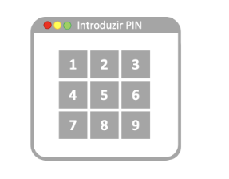

# Fundamentos da Programação - Projeto 1

# Buggy Data Base (BDB)

Neste primeiro projeto de Fundamentos da Programação os alunos irão desenvolver as
funções que permitam resolver cinco tarefas independentes para identificar e corrigir os
problemas de uma base de dados (Buggy Data Base, BDB) que ficou corrompida por
causas desconhecidas. A BDB contém a informação de autenticação dos utilizadores de
um sistema e está a recusar erradamente o acesso de alguns dos utilizadores registados.
As tarefas consistirão em: 
 - 1) Correção da documentação.
 - 2) Descoberta do PIN da base de dados.
 - 3) Verificação da coerência dos dados.
 - 4) Desencriptação do conteúdo.
 - 5) Depuração de senhas.

## 1 Correção da documentação

### 1.1 Descrição do problema

O primeiro passo para começar a resolver os problemas da BDB é estudar a docu-
mentação fornecida. Infelizmente, a documentação também está corrompida, mas por
sorte foram detetados alguns padrões de alterações no texto que podem ser revertidos.
O primeiro padrão de alteração afeta as palavras do texto de forma individual: um
surto de letras formado por pares de carateres da mesma letra minúscula/maiúscula
foram inseridos nas palavras repetidamente. Para recuperar cada palavra, é preciso
corrigir este surto. Para isso, quando um par minúscula/maiúscula da mesma letra se
encontram adjacentes estasreagemdesaparecendo. Por exemplo:

```
- Em ’aA’, ’a’e ’A’reagem, deixando a cadeia de carateres vazia.
- Em ’aBbA’, ’Bb’autodestrói-se, deixando ’aA’ que, como acima, também reage não deixando nada.
- Em ’abAB’, não há duas letras adjacentes compat ́ıveis, portanto, nada acontece.
- Em ’aabAAB’, embora’aa’e ’AA’ representem um par da mesma letra, as duas
    são minúsculas ou maiúsculas e, portanto, nada acontece.
- Em ’cCdatabasacCADde’, produz-se a seguinte sequência de reações(indicadas entre parêntesis retos) até obter a palavra’database’:
    ’[cC]databasacCADde’ → ’databasa[cC]ADde’ → ’databas[aA]Dde’ →
    → ’databas[Dd]e’ → ’database’
```


Após a correção dosurto de letras, existe um segundo padrão de erros: aparecem palavras
sem sentido no texto que correspondem a anagramas de palavras anteriores. A solução
parece simples: para cada nova palavra,é preciso detetar e eliminar todos os anagramas
(diferentes de si próprio) que se encontram no resto do texto.

### 1.2 Trabalho a realizar

O objetivo desta tarefaé escrever um programa em Python que permita corrigir a
documentação da BDB conforme descrito anteriormente. Para isso,é necessário definir
o conjunto de funções solicitadas, assim como algumas funções auxiliares adicionais,
caso seja necessário. Apenas as funções para as quais a verificação da correção dos
argumentosé explicitamente pedida devem verificar a validade dos argumentos, para as
outras assume-se que estão corretos.

---

## 2 Descoberta do PIN

### 2.1 Descrição do problema

Ao fazerdouble-click para abrir o ficheiro que cont ́em a BDB, abre-se uma janela com
um painel de d ́ıgitos com o seguinte aspet:



```
Figura 1: Painel com botões para a introdução do PIN da BDB.
```
Aparentemente, para aceder ao conteúdo da base de dados ́e necessário um PIN desco-
nhecido. No entanto, entre a documentação fornecida, encontra-se o seguinte texto:

```
“Para melhorar a segurança, os códigos da base de dados deixaram de ser
anotados. Em vez disso, memorize e siga o procedimento abaixo.”
```

A documentação continua explicando que cada botão a ser pressionado pode ser encon-
trado iniciando no botão anterior e movendo para botões adjacentes no teclado: ’C’
move para cima, ’B’ move para baixo,’E’ move para a esquerda e’D’ move para
direita. Cada linha de instruções corresponde a um botão, iniciando no botão anterior
(ou, para a primeira linha, o botão’5’); pressione qualquer botão em que estiver no
final de cada linha. Se um movimento não levar a um botão ignore este movimento.
Por exemplo, suponha que suas instruções estão codificadas num tuplo de strings como
o seguinte:

```
(‘CEE’, ‘DDBBB’, ‘ECDBE’, ‘CCCCB’)
```
Começando no’5’, mover para cima (’2’), para a esquerda (’1’) e para a esquerda
(não podes e permaneces em’1’), então o primeiro botão ́e’1’. Começando com o
botão anterior (’1’), mover para a direita duas vezes (’3’) e depois para baixo três
vezes (parando em’9’após dois movimentos e ignorando o terceiro), terminando com
’9’. Continuando a partir de’9’, mover para a esquerda, para cima, para a direita,
para baixo e para a esquerda, terminando com’8’. Finalmente, mover para cima quatro
vezes (parando em’2’), depois para baixo uma vez, terminando com’5’. Portanto,
neste exemplo, o código da base de dados ́e 1985.

### 2.2 Trabalho a realizar

O objetivo desta tarefa ́e escrever um programa em Python que permita encontrar o
PIN da BDB conforme descrito anteriormente. Para isso, deverá definir o conjunto de
funções solicitadas, assim como algumas funções auxiliares adicionais, caso considere
necessário. Apenas as funções para as quais a verificação da correção dos argumentos ́e
explicitamente pedida devem verificar a validade dos argumentos.

---

## 3 Verificação de dados

### 3.1 Descrição do problema

Consegue-se aceder aos dados da BDB, mas claro, as entradas estão encriptadas e o pro-
cesso de desencriptação ́e computacionalmente pesado. Por sorte, existe uma sequência
de controlo para cada entrada que permite detetar entradas erradas e assim reduzir a
quantidade de dados que ́e preciso desencriptar. A deteção de uma entrada errada não
garante que a senha correspondente esteja errada (porque a alteração pode afetar ou-
tras informações do utilizador contidas na BDB), mas permite reduzir a lista de casos
suspeitos.
Cada entrada da BDB ́e representada como um tuplo com 3 campos: uma cadeia de cara-
terescifracontendo uma ou mais palavras encriptadas separadas por traços; uma outra
cadeia de caratereschecksumcontendo uma sequência de controlo (5 letras minúsculas
entre parêntesis retos); e finalmente um tuplo com dois ou mais números inteiros posi-
tivos de segurança (ainda não usados nesta fase). As palavras que constituem acifra
apenas podem estar formadas por letras minúsculas (tamanho m ́ınimo 1). Uma entrada
da BDB está correta apenas se a sequência de controlo ́e formada pelas cinco letras
mais comuns na sequência encriptada, por ordem inversa de ocorrências, com empates
decididos por ordem alfab ́etica. Por exemplo:

```
- (’aaaaa-bbb-zx-yz-xy’, ’[abxyz]’, (950,300))está correto porque as letras
    mais comuns são ‘a’ (5 ocorrências), ‘b’ (3 ocorrências) e um empate entre ‘x’, ‘y’
    e ‘z’, que são listados em ordem alfab ́etica.
- (’a-b-c-d-e-f-g’, ’[abcde]’, (124,325,7))está correto porque, embora as
    letras estejam todas empatadas (1 de cada), as cinco primeiras são listadas em
    ordem alfab ́etica.
- (’entrada-muito-errada’, ’[abcde]’, (50,404))está errada.
```

### 3.2 Trabalho a realizar

O objetivo desta tarefa ́e escrever um programa em Python que permita validar cada
uma das entradas da BDB conforme descrito anteriormente. Para isso, deverá definir o
conjunto de funções solicitadas, assim como algumas funções auxiliares adicionais, caso
considere necessário. Apenas as funções para as quais a verificação da correção dos
argumentos ́e explicitamente pedida devem verificar a validade dos argumentos.

---

## 4 Desencriptação de dados

### 4.1 Descrição do problema

Com a BDB filtrada e todas as entradas erradas detetadas, está na hora de as desen-
criptar para tentar descobrir quais são os utilizadores com senhas corruptas.
A informação da BDB está encriptada por uma cifra de troca. Para desencriptar o
conteúdo de cada entrada, primeiro ́e preciso determinar o número de segurança. O
número de segurança corresponde `a menor diferença de entre todos os números contidos
na sequência de segurança (última posição do tuplo que representa cada entrada da
BDB). A seguir, ́e preciso trocar cada letra avançando no alfabeto um número de vezes
igual ao número de segurança de cada entrada mais um para as posições pares, e menos
um para as posições ́ımpares do texto: com número de segurança igual a 2 a letra‘a’
torna-se‘d’se estiver numa posição par da string ou‘b’se estiver numa posição ́ımpar;
com o mesmo número de segurança a letra‘z’ torna-se‘c’se estiver numa posição
par ou‘a’se estiver numa posição ́ımpar. Os traços transformam-se em espaços. Para
determinar a posição par ou ́ımpar de um caráter ́e considerada a cadeia de carateres
completa com o primeiro caráter na posição par ( ́ındice 0). Por exemplo, para a seguinte
entrada (com código de controlo errado):

```
(’qgfo-qutdo-s-egoes-wzegsnfmjqz’, ’[abcde]’, (2223,424,1316,99))
```
o número de segurança ́e 325 (424−99) e o conteúdo decifrado ́e’esta cifra e quase
inquebravel’.

### 4.2 Trabalho a realizar

O objetivo desta tarefa ́e escrever um programa em Python que permita desencriptar
as entradas da BDB conforme descrito anteriormente. Para isso, ́e necessário definir
o conjunto de funções solicitadas, assim como algumas funções auxiliares adicionais,
caso sejam necessárias. Apenas as funções para as quais a verificação da correção dos
argumentos ́e explicitamente pedida devem verificar a validade dos argumentos.

---

## 5 Depuração de senhas

### 5.1 Descrição do problema

Após de detetar as entradas da BDB erradas e desencriptar o conteúdo com o algoritmo
desenvolvido, ́e poss ́ıvel obter uma lista de dicionários com o nome de utilizador (chave
’name’), a senha potencialmente corrompida (chave’pass’)) e a regraindividual de
quando essa senha foi definida (chave’rule’)). O resto de informações de utilizador
contidas na BDB (tamb ́em potencialmente corrompidas) não são relevantes. Por exem-
plo:

```
[ {’name’:’john.doe’, ’pass’:’aabcde’, ’rule’:{’vals’:(1,3), ’char’:’a’}},
{’name’:’jane.doe’, ’pass’:’cdefgh’, ’rule’:{’vals’:(1,3), ’char’:’b’}},
{’name’:’jack.doe’, ’pass’:’cccccc’, ’rule’:{’vals’:(2,9), ’char’:’c’}} ]
```

De acordo com a documentação fornecida, existem dois conjuntos de regras que devem
ser cumpridas na definição de senhas: as regrasgerais e as regrasindividuais.
As regrasgeraissão aplicadas a todas as senhas e são as seguintes:

```
- As senhas devem conter pelo menos três vogais minúsculas (’aeiou’),
- As senhas devem conter pelo menos um caráter que apareça duas vezes consecutivas.
```

As regrasindividuaissão codificadas pelo valor da chave’rule’de cada entrada como
dicionários com as chaves ’vals’e’char’. O valor de‘vals’ ́e um tuplo de dois
inteiros positivos correspondentes ao menor (primeira posição) e o maior (segunda
posição) número de vezes que uma determinada letra minúscula (valor da chave’char’)
deve aparecer para que a senha seja válida. Por exemplo, a regra{’vals’: (1,3),
’char’:’a’}significa que a senha deve conter a letra’a’pelo menos 1 vez e no máximo
3 vezes. O valor que representa o máximo número de vezes que aparece a letra ́e sempre
maior ou igual que o m ́ınimo.
No exemplo acima, apenas a primeira senha ́e válida. A senha do meio,‘cdefgh’não ́e
válida, porque não cumpre nenhuma das regras gerais (não cont ́em 3 vogais, nem duas
letras consecutivas iguais), nem a regra individual (não cont ́em instˆancias de ‘b’, e
precisa de pelo menos 1). A terceira senha cumpre a regra individual (cont ́em 6‘c’),
mas apenas uma das regras gerais (não cont ́em 3 vogais). A primeira senha ́e válida:
cont ́em 2‘a’(dentro dos limites da sua regra individual), 3 vogais (2’a’e 1’e’) e
uma sequência de dois carateres iguais (’aa’).

### 5.2 Trabalho a realizar

O objetivo desta tarefa ́e escrever um programa em Python que permita encontrar os
utilizadores com senhas que não cumprem as regras descrita atrás. Para isso, deverá de-
finir o conjunto de funções solicitadas, assim como algumas funções auxiliares adicionais,
caso considere necessário. Apenas as funções para as quais a verificação da correção dos
argumentos ́e explicitamente pedida devem verificar a validade dos argumentos.